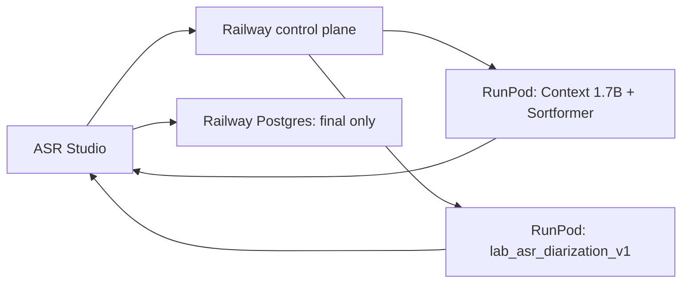

# アーキテクチャ

## 処理方式

### realtime

`音声入力 → Silero VAD → Context partial/final + Sortformer → 発話置換 → 保存`

### batch

`ファイル → lab_asr_diarization_v1 → 話者タグ正規化 → 保存`

### hybrid

`音声入力 → Silero VAD → Context partial + Sortformer → 480ms endpoint → lab finalizer → 同一発話置換 → 保存`

## 状態の所有者

- Railway: session、processing mode、worker assignment、final transcript。
- realtime worker: VAD、発話境界、partial、Sortformer、実工程 telemetry。
- batch worker: lab model 常駐、最終推論、話者ターン正規化。
- browser: 音声送信、現在の発話状態、フロー reducer、IndexedDB outbox。

## 障害時

- worker が失われた場合は、その worker が所有する ready/active assignment だけを requested へ戻し、worker の capacity counter を同じ操作で減算して再割当する。hybrid の sibling assignment は維持する。
- session 完了、削除、期限切れでは全 assignment を解放する。
- batch finalizer が失敗した場合は Context 暫定結果を残し、`fallback` を表示する。
- 保存に失敗した final は outbox へ入り、古い revision は新しい final を上書きしない。
